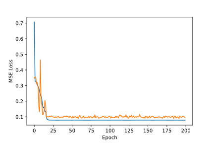
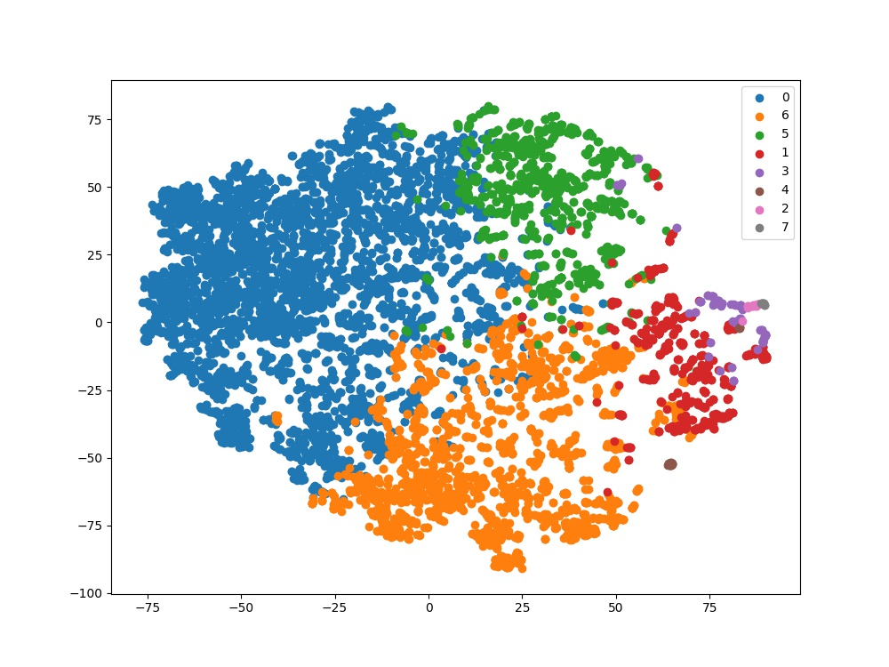

# Motion Library

The Motion Library provides easy-to-use interfaces and tools to work with motion capture data. The objective of the library is to hide the complexity of mocap file formats, 3D geometry, motion representation and visualization, and let users focus on high level learning tasks.


## Installation
To run a clean install of the library, first create a virtual environment with Python3, and activate it.
```
virtualenv --python=python3 FOLDER/mocap_processing
. FOLDER/mocap_processing/bin/activate
```
Now install the project using `pip`. This will also pull in external dependency [amass](https://github.com/nghorbani/amass).
```
pip install -e .
```

## Tasks
The `tasks` module showcases practical usages of the motion classes, models and visualization tools. Below, we list tasks that have been used in different projects. They build the basic infrastructure to enable incremental addition of more features. 

### Reconstruction
Reconstruction is simple sequential modeling task that aims to generate trajectories that mimic the input motion sequence. This task serves as proof of concept for the application of [Attention based Sequence to Sequence models](https://arxiv.org/abs/1409.0473) to human motion capture data. The models are based on LSTM units and use concatenated attention scheme. We split the dataset into train and test, train and regularly evaluate the model for specified number of epochs and plot learning curve.



### Clustering of motion capture dataset
In this task, we semantically cluster motion sequences from a large motion capture dataset, specifically the [AMASS dataset](http://amass.is.tue.mpg.de/). We implement two quick methods to generate features for sequences -- the first based on [joint heuristics](https://dl.acm.org/doi/10.1145/1073204.1073247) and the second based on [kinetic energy](https://www.researchgate.net/publication/251419971_FMDistance_A_fast_and_effective_distance_function_for_motion_capture_data) and acceleration of joints. We cluster the features using KMeans and Hierarchical approaches and visualize their t-SNE embeddings.



t-SNE embeddings of sequences from AMASS CMU dataset; 8 clusters formed by k-means clustering

### Changepoint detection
We implement an acceleration based changepoint detection algorithm in `mocap_processing/tasks/changepoint_detection`.


## Future Work
- Addition of models and tasks dealing with dynamic control, like reinforcement learning for physical simulation of motion
- More kinematic models to provide task-specific motion representation
- Integration of PyBullet simulation environment
- Data augmentation tools to enrich low resource motion capture datasets

## Authors
Deepak Gopinath, Jungdam Won, Kalesha Bullard
